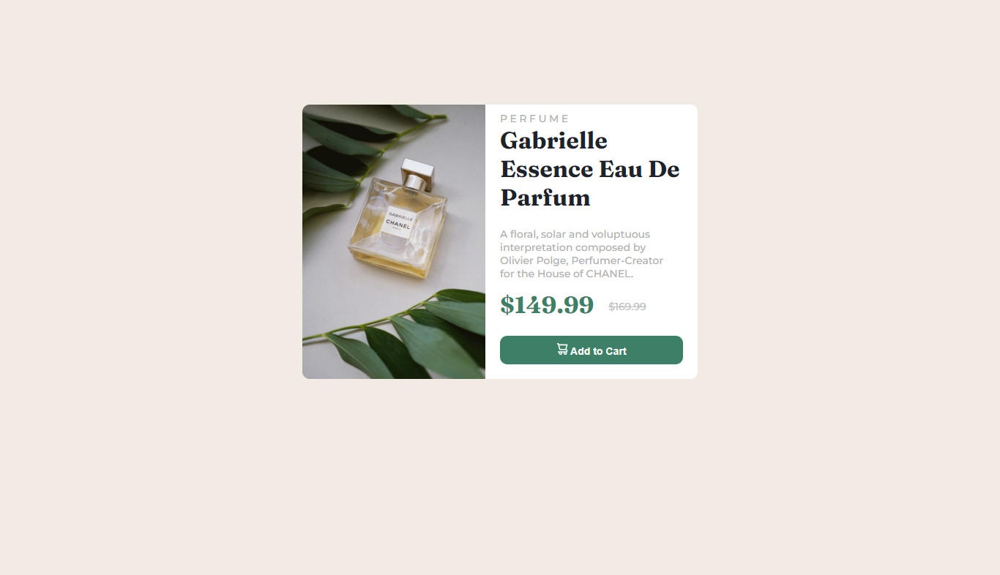

# product-preview-card-component
# Frontend Mentor - Product preview card component solution

This is a solution to the [Product preview card component challenge on Frontend Mentor](https://www.frontendmentor.io/challenges/product-preview-card-component-GO7UmttRfa). Frontend Mentor challenges help you improve your coding skills by building realistic projects. 

## Table of contents

- [Overview](#overview)
  - [The challenge](#the-challenge)
  - [Screenshot](#screenshot)
  - [Links](#links)
- [My process](#my-process)
  - [Built with](#built-with)
  - [What I learned](#what-i-learned)
  - [Continued development](#continued-development)
  - [Useful resources](#useful-resources)
- [Author](#author)
- [Acknowledgments](#acknowledgments)


## Overview

This is a solution to the [Product preview card component challenge on Frontend Mentor]

### The challenge

Users should be able to:

- View the optimal layout depending on their device's screen size
- See hover and focus states for interactive elements

### Screenshot



### Links

- Solution URL: (https://github.com/Nikkaburger/product-preview-card-component)
- Live Site URL: (https://nikkaburger-product-preview-card.netlify.app/)

## My process

### Built with

- Semantic HTML5 markup
- CSS custom properties
- Flexbox
- CSS Grid
- Mobile-first workflow

### What I learned


```html
<body>
    <div class="container">
        
        
    <div class="description">
    <h3>
        PERFUME
    </h3>
    <h1>
        Gabrielle   Essence Eau De Parfum
    </h1>
    <p>
        A floral, solar and voluptuous interpretation composed by Olivier Polge, Perfumer-Creator for the House of CHANEL.
    </p>
    <div class="pricing">
        <span class="discount">
            $149.99
        </span>
        <div class="price">
            $169.99
        </div>
    </div>
    <button type="button" class="button"> 
        
         Add to Cart </button>
    </div>
    </div>
</body>

```
```css
body {
    font-size: 14px;
    margin: 0px;
    display: flex;
    justify-content: center;
    align-items: center;
    text-decoration: none;
    background-color: hsl(30, 38%, 92%);
    font-family: 'Montserrat', sans-serif;
    overflow-x: hidden;
}

p {
    font-weight: 700;
    color: #adadad;
    padding-right: 20px;
}

.container {
    height: 627px;
    width: 345px;
    border-radius: 10px;
    flex-direction: column;
    border-style: none;
    margin: 15px 10px;
}

.webimage {
    display: none;
}

.imagebox {
    display: block;
    width: 345px;
    height: 250px;
    margin: 0px;
    justify-self: center;
    border-radius: 10px 10px 0px 0px;
}

.description {
    width: 325px;
    height: 382px;
    border-radius: 0px 0px 15px 15px;
    padding-top: 20px;
    padding-left: 20px;
    margin-top: -20px;
    background-color: hsl(0, 0%, 100%);
}

h1 {
    font-size: 32px;
    color: hsl(212, 21%, 14%);
    font-family: 'Fraunces', serif;
    font-weight: 700;
}

h3 {
    color: #afafaf;
    font-weight: 500;
    margin-top: 25px;
    margin-bottom: -10px;
    letter-spacing: 2.5px;
}

.pricing {
    margin: 0px;
    display: flex;
}

.discount {
    font-size: 36px;
    color: hsl(158, 36%, 37%);
    font-family: 'Fraunces', serif;
}

.price {
    font-size: 16px;
    padding-left: 20px;
    text-decoration: line-through;
    color: #afafaf;
    font-weight: 500;
    line-height: 45px;
}

```


### Continued development

My focus is on mastering modern web design techniques through continuous learning, experimentation, and a willingness to adapt to the ever-changing web landscape. 
By focusing on responsive design using, HTML5, CSS3, JavaScript, and PHP, to be adequately equipped to create visually stunning and user-friendly websites. Embrace new technologies, stay curious, and push the boundaries of my creativity to unlock endless possibilities in the world of web development. 


### Useful resources

- [#CSSMediaQuery](https://courses.webdevsimplified.com) - This helped me to understand and fix media query for the mobile version of my design, the tutorial was direct and explanatory. I really liked this pattern and will use it going forward.
- [#HTMLFullCourseforBeginners](https://courses.davegray.codes/) - This is an amazing course which helped me finally understand the functionality of #HTML5 tags. I'd recommend it to anyone still learning this concept.
-[#CSSTutorialFullCourseforBeginners](https://courses.davegray.codes/) - This is an amazing course which helped me finally understand CSS tags, syntax and their functionalities. I'd recommend it to anyone still learning this concept.

## Author

- Website - [Oluwaseun Akeju](https://www.fluxverge.com)
- Frontend Mentor - [@nikkaburger](https://www.frontendmentor.io/profile/nikkaburger)
- Twitter - [@fluxverge](https://www.twitter.com/fluxverge)

## Acknowledgments

Special thanks to Almighty God for the completion of this task, my profound gratitude to Dave Gray, Omolade Sunday, Akinola Akeem and Webdevsimplified for their immense contributions.
